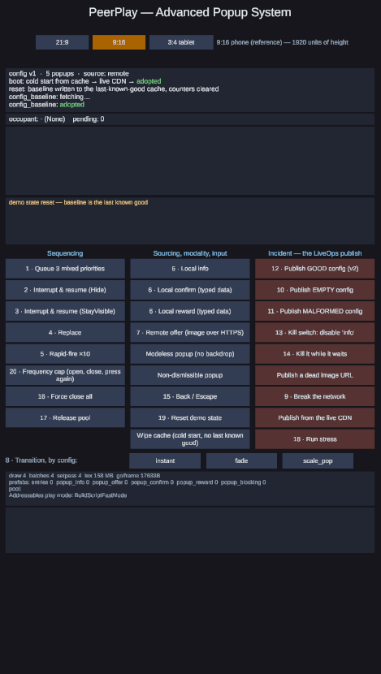
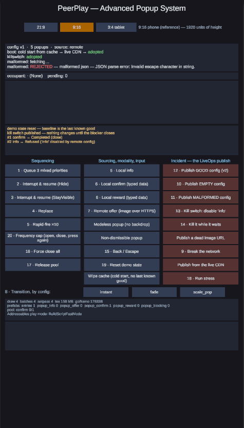
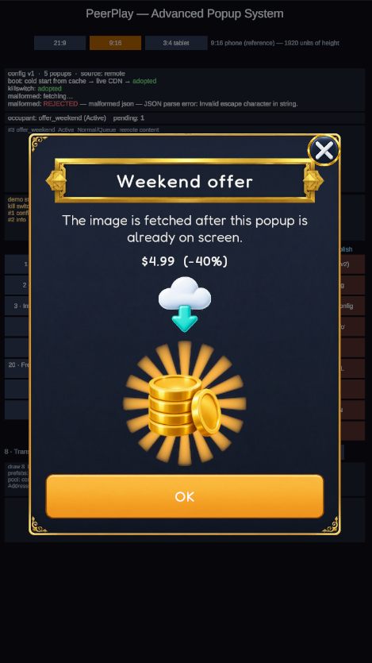

# PeerPlay — Advanced Popup System

A popup queue with priority-based sequencing, a strict lifecycle, and local + remote sourcing, built so that a
bad remote publish cannot take the popups away.

`Unity 6000.0.64f1` · UniTask · DOTween · Addressables · UGUI + TextMeshPro · Android / Editor.
A test-task deliverable: the system and a demonstration scene, no gameplay.

| | | |
|:--:|:--:|:--:|
|  |  |  |
| **The board.** Every graded capability has a control, and the panel above them shows the queue as it is: what holds the slot, in which lifecycle state, and what waits behind it. | **The publish that would have broken a live game.** A malformed config is refused — with the parser's own reason — and the last known good one keeps serving. The kill switch published before it stayed adopted. | **Remote content.** The popup opened on a local prefab immediately; the image arrived from CloudFront afterwards and landed into it. Nothing waited on the network. |

Screenshots are from the Android build; the same scene runs in the Editor.

---

## Run it in 60 seconds

1. Open the project in **Unity `6000.0.64f1`** (the version it was authored in; the Hub will not offer an
   upgrade).
2. Open `Assets/Scenes/PopupDemo.unity`.
3. Press **Play**. The Game view is portrait; any aspect works, the demo has its own aspect switcher.
4. Press **`10 · Publish EMPTY config`**, then **`6 · Local info`**. That is the whole argument in two clicks.

No device build, no Addressables content build, and no network is needed for the local beats. The supported
Addressables play mode is **Use Asset Database** — the mode selection lives in `Library/`, which is gitignored,
so it is what a fresh clone starts in; the project is designed for that mode rather than working around it.
The remote **config** and the remote **image** are real HTTPS in every play mode; the remote **prefab** surface
is only real in a packed build (see Known limitations).

Keep the Editor focused while Play mode runs: **Run In Background** is off (the template default), so an
unfocused Editor stops ticking the player loop and the demo looks frozen rather than broken.

---

## Press this one first — a publish that cannot break the game

Publishing a config is the most common way to break a live game without shipping a release. The payload is
authored somewhere else, it lands on every client at once, and nothing about it went through a build.

So a config is **validated before it is adopted**, never after:

- 13 structural rules run in pure C# (`Sourcing/PopupConfigValidator.cs`) — payload size in **bytes**, JSON
  shape, duplicate ids, unknown enum values, empty popup list. A 14th rule lives on the service because it has
  to probe Addressables: every `assetId` a config names must actually resolve.
- Validation is **all-or-nothing**. A half-adopted config is the same failure as an empty one.
- A rejected payload leaves the previous config live. On the next launch the device's **last-known-good** copy
  is adopted, so a bad publish does not survive a restart either.
- A config that was accepted but skipped asset resolution is deliberately **not** written to that cache
  (`Sourcing/RemotePopupConfigService.cs`) — otherwise an unverified payload becomes the boot config forever.
- Every popup carries a **kill switch** in the config (`"state": "enabled"`), consulted when a request is
  submitted **and** again when it is admitted. A popup already queued behind another one still gets stopped.
- A refusal is **reported**, not swallowed: it is a terminal outcome with a reason string, delivered through
  the same channel every other outcome uses.

In the demo: `10 · Publish EMPTY config` and `11 · Publish MALFORMED config` are rejected by name and the
adopted version does not move; `12 · Publish GOOD config (v2)` proves the two rejections were not inert;
`13 · Kill switch: disable 'info'` turns a popup off with no release; `14 · Kill it while it waits` shows the
second consultation, where a queued popup is refused without ever opening.

Why this belongs in a popup system: a popup is an offer, an offer is published by LiveOps, and a publish is
the thing that goes wrong at 9pm.

---

## What it does — spec coverage

| Requirement | Where it lives | How to see it |
|---|---|---|
| A queue managing multiple requests | `Core/PopupQueue.cs`, `Core/PopupService.cs::PumpAsync` | `1 · Queue 3 mixed priorities` |
| Priority-based sequencing | `Core/PopupPriority.cs`, `PopupQueue.DequeueHighest` | same — submission order Low/Normal/Critical, playback order reversed |
| Some popups interrupt, others wait | `Core/PopupSequencing.cs` (`Queue` / `InterruptAndResume` / `Replace`) | `2 · Interrupt & resume (Hide)`, `4 · Replace` |
| Strict lifecycle | `Core/PopupState.cs`, `Core/PopupStateMachine.cs` | the queue panel prints each row's state as it moves |
| Local popups (bundled) | `Sourcing/LocalPopupViewSource.cs`, `View/PopupCatalog.cs` | `6 · Local info / confirm / reward` |
| Remote popups — asset | `Sourcing/AddressablesPrefabLoader.cs`, `Sourcing/RefCountedViewSource.cs` | `7 · Remote offer` (Addressables entry; bytes over the wire only in a packed build) |
| Remote popups — content | `Sourcing/RemoteImageSource.cs`, `View/Popups/OfferPopupView.cs` | `7 · Remote offer` — the image arrives after the popup is already up |
| Remote popups — configuration | `Sourcing/RemotePopupConfigService.cs`, `Sourcing/PopupCatalogConfigBridge.cs` | the status line at the top; `10`–`13` |
| Type-safe data injection | `Core/PopupKey.cs`, `View/PopupViewOfT.cs`, `View/Popups/PopupPayloads.cs` | `6 · Local confirm (typed data)` — the wrong payload is a compile error |
| Flexible transitions | `View/Transitions/IPopupTransition.cs`, `PopupTransitionRegistry.cs` | `8 · Transition, by config: instant / fade / scale_pop` |
| Modality and backdrop | `View/PopupModality.cs`, `View/PopupLayer.cs` | `Modeless popup (no backdrop)` vs any modal one |
| Input blocking | `View/PopupLayer.cs` (counted input gate; the backdrop owns its own `CanvasGroup`) | press a button behind a modal popup — nothing happens; behind a modeless one it works |
| Non-blocking async | UniTask throughout; `Sourcing/HttpWithRetry.cs`, `AddressablesPrefabLoader` | `7 · Remote offer` opens instantly with a placeholder |
| Failed remote fetch | `Sourcing/HttpWithRetry.cs`, `HttpResult.cs` | `9 · Break the network` — retries with backoff, then a named failure; local popups keep working |
| Rapid-fire input | `PopupService.Submit` + `PopupDuplicatePolicy` | `5 · Rapid-fire ×10` — 4 live rows, 6 duplicates rejected in the same frame |
| Pooling / reuse | `View/PopupPool.cs`, `View/PooledPopupViewFactory.cs` | `18 · Run stress`, then `17 · Release pool` |
| Frequency capping | `Sourcing/ConfigPopupPolicy.cs` (`IPopupPolicy` seam) | `20 · Frequency cap` — the second press is refused |

---

## Architecture

```
    call site ──► IPopupService ──► PopupQueue (bands: Critical/High/Normal/Low + suspend stack)
                       │                  │
                       │                  ▼
                       │           PopupStateMachine
                       │   None→Pending→Initializing→Opening→Active→Suspended→Closing→Disposed
                       │                  │
                       │                  ▼
                       │        one latched terminal path ──► RequestCompleted / awaited PopupResult
                       ▼
              IPopupViewFactory ──► PopupPool ──► IPopupViewSource
                       │                              │
                       ▼                              ├── local prefab      (bundled)
                  IPopupView                          └── Addressables      (remote asset)
                  IPopupTransition
                       ▲                          RemotePopupConfigService  (remote config, HTTPS)
                       │                          RemoteImageSource         (remote content, HTTPS)
    seams: IPopupPolicy · IPopupAnalytics · IPopupTextProvider · IPopupClock · IPopupView · IPopupViewFactory
```

The queue is a state machine with one occupant, a band per priority and a suspend stack for interrupted
popups. Illegal transitions throw by name rather than being silently ignored (`Core/PopupStateMachine.cs`).

**Every outcome leaves through one latched terminal path** — completed, refused, duplicate, load-failed,
superseded, cancelled, faulted (`PopupService.FinishAsync`). A second exit is how a queue wedges; the latch
makes a double terminal unrepresentable instead of merely avoided. Every call into foreign code — the view,
the factory, the policy, the analytics sink, the awaiter — is guarded, because a third-party throw must not
pin the slot.

---

## The assembly boundary, and what it makes impossible

```
PeerPlay.Popups          → UniTask                                (no UGUI, no TMP, no DOTween, no Addressables)
PeerPlay.Popups.View     → Core, UniTask, UniTask.DOTween, DOTween.Modules, UnityEngine.UI, Unity.TextMeshPro
PeerPlay.Popups.Sourcing → Core, View, UniTask, UniTask.Addressables, Unity.Addressables, Unity.ResourceManager
PeerPlay.Popups.App      → Core, View, Sourcing, UniTask, UnityEngine.UI, Unity.TextMeshPro  (composition root + demo)
+ PeerPlay.Popups.App.Demo.Editor      (Editor-only: App, Unity.Addressables.Editor)
+ PeerPlay.Popups.Tests, PeerPlay.Popups.ViewSourcing.Tests   (EditMode)
```

"Queue logic independent of UI rendering" is compiler-enforced here, not a convention: the core **cannot**
reference a `Canvas`, a `Tweener` or an `AsyncOperationHandle` — those references are unavailable to it, not
merely unused. That is also what makes the queue testable in EditMode with no scene.

It is **UI-free, not engine-free**. The core reaches `UnityEngine` in five files:

| File | What it uses | Why |
|---|---|---|
| `Core/PopupLog.cs` | `UnityEngine.Debug`, via `using Debug = UnityEngine.Debug;` | the core's own tracing |
| `Core/PopupService.cs` | `Debug.LogWarning` / `LogError` / `LogException` | rejection, fault and pump-abort reporting |
| `Core/Defaults/LoggingPopupAnalytics.cs` | `Debug.Log` | the default analytics sink |
| `Core/Defaults/PassthroughTextProvider.cs` | `Debug.LogWarning` | the missing-key warning |
| `Core/Defaults/UnityPopupClock.cs` | `Time.realtimeSinceStartup` | the default clock — the one non-logging engine use |

(`Core/Seams/IPopupView.cs` mentions `UnityEngine.UI` in a doc comment; that is not a reference.)

---

## The trigger API

```csharp
// Fire and forget. No awaiter is allocated.
popups.Show(PopupKeys.Reward, new RewardData(1200, "coins"));

// With options: priority, sequencing, duplicate policy.
popups.Show(PopupKeys.Offer, new OfferData("weekend", "$4.99", 40),
            new ShowOptions(PopupPriority.Critical, PopupSequencing.InterruptAndResume));

// When the outcome matters. Cancellation is an outcome, never an exception.
PopupResult result = await popups.ShowAsync(PopupKeys.Confirm, new ConfirmData("Spend 200 coins?"), default, ct);
if (result.Outcome == PopupOutcome.Completed && result.Action == "confirm") { /* … */ }

// The wrong payload for a key does not compile — the key carries its data type.
popups.Show(PopupKeys.Reward, new ConfirmData("nope"));   // CS1503 at build time
```

Terminals for requests nobody awaited arrive on `IPopupService.RequestCompleted`, which fires for **every**
request including the ones rejected before they were ever registered.

**Extension without touching the core.** A new popup type is one `PopupView<TData>` subclass
(`View/PopupViewOfT.cs`) plus a catalog row (`Assets/Scripts/View/Popups/` holds four worked examples). A new transition is one `IPopupTransition`
implementation plus a registry id, and the id is a **string the remote config can select** — so an appearance
change is a publish, not a rebuild. An unknown id falls back to `instant` with a warning instead of throwing.
Neither touches a file in `PeerPlay.Popups`.

---

## Evidence

### Tests

**119 EditMode tests, all green** (`PeerPlay.Popups.Tests` + `PeerPlay.Popups.ViewSourcing.Tests`; a full
EditMode run reports 120 — the extra one is a stub test from inside the Addressables package). Run them with
Window → General → Test Runner → EditMode → Run All. Coverage by area: core queue and lifecycle, terminal
paths and guards, view/pool/transitions, sourcing and HTTP retry, config validation and adoption, policy caps.

The suite includes a **seeded fuzz** (`PopupFuzzTests.cs`): 10 000 randomised operations per seed, five seeds,
holding create/open/close open so the run constructs real interleavings. After **every** operation it asserts
that there are never two active popups, that no state sits outside the legal transition table, that no orphan
instance exists, and that every recorded transition was legal. Two of its invariants are narrower than that
and are stated rather than glossed: the "no unprovoked force-terminate" assertion is **disabled for the
remainder of a run once that run has injected a fault**, and the terminal "the queue drained" assertion is
reached through a `ForceCloseAll()` fallback inside the quiescence loop, so it does not prove the pump drains
unaided.

The code went through three review passes. **Every Critical they found is fixed**, each carrying a test that
fails if the fix is removed, and the fixes were re-verified by a separate reviewer working from the code
rather than from the fix list. **Most of the Warnings are not fixed** — they are the Known limitations
below, named one by one, and that is a deliberate call: they are late findings in code that is merged and
covered, where the change costs more risk than the defect does.

The measurement run below then found one the reviews had missed: the HTTP layer's whole-operation budget was
armed with a timer nobody could stop, so it outlived the token source it was meant to cancel and logged an
`ObjectDisposedException` on the player loop one deadline after every **successful** request. Fixed, with a
test that goes red if the handle becomes a no-op again.

### The measured numbers

**Recipe, repeat it in about a minute.** Open `Assets/Scenes/PopupDemo.unity` in `6000.0.64f1`, Play,
Addressables in **Use Asset Database**, press **`18 · Run stress`**. The run discards **3 warm-up cycles per
key**, then measures 50 cycles on a **Modeless + instant** key, 51 cycles mixed across the three local Modal
keys, and 20 cycles of **Modal + fade**; it prints the table and copies it to the clipboard. Any outcome other
than `Completed` aborts the run and prints why instead of a table. The other columns are read off the
diagnostics overlay, which samples the same counters in `LateUpdate` every frame.

Instruments: `ProfilerRecorder` (`Render` → Draw Calls / Batches / SetPass; `Memory` → GC Allocated In Frame)
and the project's **own** refcounts, which sit one layer above `Addressables.Release`.
`GC.GetAllocatedBytesForCurrentThread()` is not used: it compiles and returns a constant 0 on this Editor's
Mono runtime. **Texture Memory was recorded and then dropped from the table**: that counter is editor-wide and
quantised to whole megabytes, so it reads 175 MB with a popup up, with the pool full and after the pool is
released — it cannot tell a leaked atlas from a released one, and a metric that discriminates nothing is worse
in a README than no metric, because it invites the reader to assume we did not notice.

Run of 2026-08-19, Editor `6000.0.64f1`, Windows, Play mode:

| Metric | Idle baseline | 1 popup Active | After the run | After `17 · Release pool` | Criterion | |
|---|---|---|---|---|---|---|
| Draw Calls | 6 | 9 | 6 | 6 | after-run == baseline | ✔ |
| Batches | 6 | 9 | 6 | 6 | same | ✔ |
| SetPass Calls | 6 | 8 | 6 | 6 | same | ✔ |
| `RefCountedViewSource.EntryCount` | 0 | 1 | 3 | 0 | == distinct assetIds used; 0 after release | ✔ |
| `RefCountOf(assetId)` | 0 | `popup_info` 1 | `popup_info` 2, `popup_confirm` 1, `popup_reward` 1 | 0 | == that asset's outstanding instances | ✔ |
| Pool live / idle | 0/0 | `info` 1/0 | `info` 0/1, `confirm` 0/1, `reward` 0/1, `stress` 0/1 | empty | **live == 0** after the run | ✔ |
| `PendingCount` | 0 | 1 | 0 | 0 | must be 0 | ✔ |
| Bytes per open — Modeless + instant, ×50 | — | — | **mean 38 425 B · max 46 515 B** | — | mean flat; max ≤ ~3× mean | ✔ (1.21×) |
| Bytes per open — Modal + fade, ×20 | — | — | **mean 36 526 B · max 63 617 B** | — | published as the animated cost | ✔ (1.74×) |
| Bytes per open — mixed Modal, ×51 | — | — | **mean 53 388 B · max 300 063 B** | — | max ≤ ~3× mean | **✘ 5.6×** |
| Terminals by outcome | — | — | all `Completed` | — | any other outcome aborts the run | ✔ |

`popup_info` reads 2 because two keys (`info` and `stress`) share that asset and each kept one idle instance:
an idle pooled instance **keeps holding its prefab refcount by design**, which is why the counters only reach
zero after `Release pool`. What is inside each allocation row: **Modeless + instant** is rent/instantiate,
bind, one layout rebuild and the terminal, with **no tween at all** — a modeless popup skips the backdrop;
**Modal + fade** is all of that plus the transition tween, the backdrop tween and their token sources.

**Two findings from the run, published as they came out. The criteria were fixed before it and were not moved
afterwards — a red row with an explanation is worth more than a green one with a threshold fitted to the
result.**

1. **The mixed-Modal row fails its own criterion** — one cycle in 51 cost 300 KB against a 53 KB mean (5.6×),
   and it reproduces: a second run of the same build put the same outlier at 312 KB. The honest reading is not
   "cause unknown" but **the instrument does not resolve it**. Each published number is
   `(GC allocated over the cycle's frames) − (frames × idle-per-frame)`; an idle frame in this session cost
   **25 512 B**, and a Modal cycle spans ~24 frames, so ~610 KB is subtracted from a ~650 KB total. The error
   budget on that subtraction is larger than the quantity being measured, so a single cycle that happened to
   span a few extra frames — a GC, an editor hiccup — lands in the row as hundreds of kilobytes. What would
   actually answer it is a per-open measurement rather than a per-frame accumulation: a Memory Profiler
   snapshot on either side of one open, or an allocation callstack sample around the cycle. **Neither was
   done**, so the row is published as it stands.
2. **The two headline rows are not comparable to each other at this precision, for the same reason.** A
   Modeless + instant cycle spans ~2 frames and a Modal one ~24, so any drift in the idle estimate lands on
   the modal rows with ~12× the leverage — which is why the fade row can read *lower* than the instant one.
   The size of that leverage was measured, not argued: one run in this session began its idle sample while a
   popup was still closing, read the idle frame 8 % high at 27 625 B, and both modal means came out
   **negative**. Each figure is an honest upper bound of its own order; the difference between two of them is
   not evidence of anything.

Not measured: no Memory Profiler snapshot, no native allocation accounting, no device run, no render thread.

### Build size — the duplicate-bundle trap

The shared UI atlas is referenced by a local prefab **and** by the remote offer prefab. An asset that is
implicit to two Addressables groups is packed into **both** bundles. Marking the atlas addressable in the
local group fixed it, and the analyzer run is tracked in [Tools/addressables-dupe-report.json](Tools/addressables-dupe-report.json):

**duplicate bundle dependencies: 38 → 0.**

Both numbers are published on purpose. A bare zero would prove nothing — zero is also what an analyze that was
never run prints.

Texture compression is **ASTC 6×6**, verified as *applied* rather than merely requested
([Tools/uikit-build-report.json](Tools/uikit-build-report.json): `overridden=True format=ASTC_6x6`). The atlas is packed with rotation off,
tight packing off, alpha dilation on and 4 px padding, with a read-back verifier that throws if any of those
drift — because with tight packing on, a concave sprite's bounding rectangle can contain a slice of its
neighbour, and a UI `Image` samples the rectangle: foreign artwork appears inside icons.

---

## Known limitations

Named because they were chosen, not missed.

1. **The remote *asset* surface is not exercised in the Editor.** In Use Asset Database mode the offer prefab
   resolves out of the AssetDatabase. Remote **config** and remote **content** are real HTTPS in every mode.
2. **Changing a live key's `assetId` in a published config needs a session restart.** The pool records the
   asset a key's instances were taken on per key; the swap is refused loudly and the original mapping kept,
   because releasing an asset a live popup is using is the worse failure.
3. **`CloseTop` returns `true` for a popup that refused to close.** It gates on `State == Active` and then
   calls `View.RequestClose`, which returns early for a non-dismissible popup. The demo reports the truth by
   reading `CurrentState` afterwards.
4. **`Show` returns a default handle for a request rejected before registration** (duplicate, refused,
   disposed service, policy throw). Those terminals are observable through `RequestCompleted`; the handle is
   not the channel for them.
5. **Two view calls are made unguarded on the caller's stack** — `CloseTop` and `PopupHandle.Close` call
   `View.RequestClose` outside the guard every other foreign call in that file uses, so a throwing view
   reaches the game's own UI callback.
6. **The policy is evaluated again at admission, after the occupant has been suspended.** If that evaluation
   refuses, the player sees a suspend/resume flicker for a popup that never opened.
7. **iOS is untested and one define is missing.** `UNITASK_DOTWEEN_SUPPORT` is set for `Android` and
   `Standalone` but not for `iPhone`, so switching the target to iOS drops the `UniTask.DOTween` assembly and
   `PopupTween.Await` stops compiling. Android/Editor is the stated scope.
8. **The measurement is honest but shallow** — main-thread bytes, per-frame render counters, our own
   refcounts. See the three findings above for what that does and does not support.
9. **One piece of global mutable state**: the pooled request free list is static, so it is shared by every
   service instance in the domain. Benign today — ids are never reused and a reset clears it.
10. **The suite's build-time guard for the shipped default config tests a copy.** `C15` validates the golden
    fixture, while the composition root ships `Assets/Config/popup-config.default.json`. They are byte
    identical today, so the test is green for a reason unrelated to its own message.
11. **One test class suppresses every error log**, including for tests that drive the real service
    (`PolicyTests.SetUp` sets `LogAssert.ignoreFailingMessages`). `ConfigTests` uses a per-test expectation
    instead.
12. **A throwing `OnReleased` orphans a pooled instance.** `PooledPopupViewFactory.Release` runs `OnReleased()`
    then `Return()` with no `try/finally`, and the core's release latch is one-shot, so there is no retry.
13. **A cancelled backdrop fade can leave the backdrop at a partial alpha.** The `catch` that claims to
    restore it is unreachable — DOTween's cancel behaviour kills the tween and completes the await normally
    instead of throwing — so the guarantee is actually provided by the next caller, which sets its own target
    immediately, rather than by the method whose comment states it.
14. **Every terminal re-drives the backdrop**, including terminals of requests that never had a view
    (`Refused`, `Duplicate`, `LoadFailed`). A refusal arriving during a modal's backdrop fade snaps the alpha,
    or briefly re-shows an opaque backdrop that absorbs taps until the closing popup's own terminal clears it.
    It self-heals; it is not gated on the completion having had a view.
15. **Two of the fuzz's invariants are conditional** — described in full under Evidence.
16. **The demo's config fixtures are Editor/desktop only.** They are read from `streamingAssetsPath`, which on
    Android is a URL inside the APK rather than a filesystem path. The popup system has no such limitation;
    the fixtures exist so the incident beats work with no network. Detail in [DECISIONS.md](DECISIONS.md).
17. **Android's hardware back button does not reach the demo.** The Escape binding reads
    `Keyboard.current`, and a phone reports no keyboard device at all, so it never fires there. Escape works
    on desktop and the on-screen Back control works everywhere. Routing the hardware key properly means an
    Input System action asset, which this demo deliberately does not ship — the popup system's back handling
    is one call (`CloseTop`), and what is missing is only the platform binding in front of it.

---

## Deliberately not built

A DI container · a generic UI framework · UI Toolkit · a custom tween engine · a save system · popup nesting
beyond one interrupt level · an authoring editor window · Addressables content-update workflows · iOS ·
a packed-build content pipeline.

The task was described as a day's work; this took about two, and the extra day went into the tests, the
measurement and the config-safety path rather than into breadth. Each line above is a decision with a reason
in [DECISIONS.md](DECISIONS.md), not a gap.

---

## Project map

```
Assets/
  Scenes/PopupDemo.unity        the demonstration scene — every beat is a numbered button
  Scripts/
    Core/                       the queue, the lifecycle, the terminal path, the seams   (no UI, no engine UI)
    View/                       views, pool, layer, modality, transitions
    Sourcing/                   Addressables, HTTP with retry, remote config + validation, remote images
    App/                        the composition root; App/Demo holds the demo only
  Editor/                       asset-pipeline tooling (atlas + Addressables setup, with read-back verifiers)
  Tests/EditMode/               the two test assemblies
  Config/                       the built-in default config that ships in the player
  StreamingAssets/DemoConfigs/  fixtures for the incident beats
Tools/                          the reports the evidence section cites
Docs/                           the screenshots at the top of this file
```

The system's own package dependencies beyond the 2D URP template are **UniTask** (async) and **Addressables**
(remote assets); the template's own packages are left as it shipped them, and nothing in the deliverable
depends on the render pipeline. Active input handling is **Input System Package (New)** — the template ships
its UI input module, and `Both` is a configuration Unity flags as unsupported on Android, so the project
commits to one backend rather than carrying two. DOTween is vendored under `Assets/Plugins/Demigiant` — the free version
**1.3.030**, licence at `dotween.demigiant.com/license.php` — because without it the project does not compile
on clone. The font is **Fredoka** under the SIL Open Font License, with the licence file beside it at
`Assets/Fonts/Fredoka-OFL.txt`. The UI art was generated for this project rather than taken from a store pack,
so everything here is redistributable.

Local content ships in the player; the remote group and the remote config live on a CloudFront distribution
under a project-specific prefix.

---

## [DECISIONS.md](DECISIONS.md)

One row per decision: what was chosen, why, and what it cost. It exists because the next conversation is built
on this test, and "what it cost" is the column that is worth reading.
